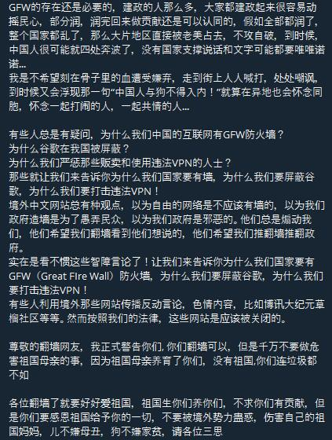

# 😇 卷首语

本笔记基于Youtuber—电丸科技AK的[科学上网科普视频](https://www.youtube.com/watch?v=XKZM\_AjCUr0\&list=PLqybz7NWybwUgR-S6m78tfd-lV4sBvGFG)。去年这个时间，我遇见了AK的视频，当时我还没有学习计算机网络的相关知识，因此看完11个视频，云里雾里，根本没有多少印象。今天一时兴起，花了一整天的时间，从头到尾再次回顾了一遍，与此同时也记了一些笔记，方便自己进行后续查阅。

### 讨论

[大家觉得以目前的情况，完全不依赖他人帮助，自学稳定翻墙的可能性有多大？](https://t.me/opencfdchannel/3500)

<figure><figcaption>
论GFW存在的必要性
</figcaption></figure>

### 箴言

1.翻墙是一个生存技能，希望你能学会。

2.推荐机场是一个不负责任的做法。推荐一定是受了利益的驱使，遇见推荐机场的，一定要理性看待。

3.墙由政治事件而起，最后连带色情网站也躺枪了。

4.不管采用什么形式的协议，都不是100%安全的。越新的协议和加密算法，往往就意味着相对的安全，越难以被GFW探测到。

5.想要长期、稳定、安全的科学上网，一定要学习Shadowsocks和V2ray这些知识。

6.GFW的封锁和突破GFW的封锁，就像破解和反破解一样，双方都在不断的进化和进步。这个博弈过程不是一成不变的。从审查机制建立以来，GFW探测和封锁和反封锁就一直处于一个此消彼长的过程和状态。

7.主流的翻墙方式依然采用了Socks5代理的Shadowsocks、ShadowsocksR、V2ray和Trojan，虽然从绝对用户基数上来说，VPN还是占据主流。但是对于有长期和稳定翻墙需求的用户来说，Socks5代理的方式才是目前最好的选择。

8.人工的方式优化GFW已经不是主流了，你要知道现在的AI技术和大数据分析，很多已经不是人工在搞了。人工面对大数据是很无力的，一旦有了成熟地利用AI和大数据分析特征的方式，一切所谓的协议和加密都只是暂时的。

9.任何一个国家，维护国家稳定，都是其最核心的利益。

10.给你设置一道坎的意义在于筛选掉了很多受教育程度和综合素质都比较底层的民众，这些人往往也没什么判断能力，很容易被反动势力带节奏和忽悠。能翻墙出去的人，往往素质相对较高，受教育程度也普遍高于平均水平，把这些人放出去不用太担心会被西方媒体带节奏或者是参与恐怖袭击。

11.中国的人口数量就决定了中国的事情从来就不会有非黑即白，即便GFW从技术上来讲，是完全有能力降低探测的标准，来更大面积地、更有效率地封杀代理服务器的。从每年的两会和多次敏感期大规模封锁IP和服务器，事后又不定时解封这件事，就能看得出来，GFW实际上是可以做到张弛有度，收放自如的。

12.既然你已经翻墙了，你不用Google，你有Bing？

13.千万别觉得某个翻墙方式能够让你一劳永逸。

14.网络信息时代，没有真正的数据安全。你的个人数据可以以任何形式泄露出去，所以要么就彻底断网，跟世界脱轨，要么就最大程度地进行自我保护。

15.我们的个人信息在互联网流量里面，就像融入大海的一滴水一样，把你单独过滤出来，就要看有没有这个必要和价值。我们普通人的个人信息其实没那么重要，别太把自己当回事。

16.翻墙之后，请约束好自己的行为，不要碰触国家法律明令禁止的一些底线。也不要传播危害国家安全的一些相关内容。

17.约束自己的行为，永远是有必要的。

18.如果你指望白嫖或者是少花钱，很多情况下你就需要拿折腾的时间来换。
