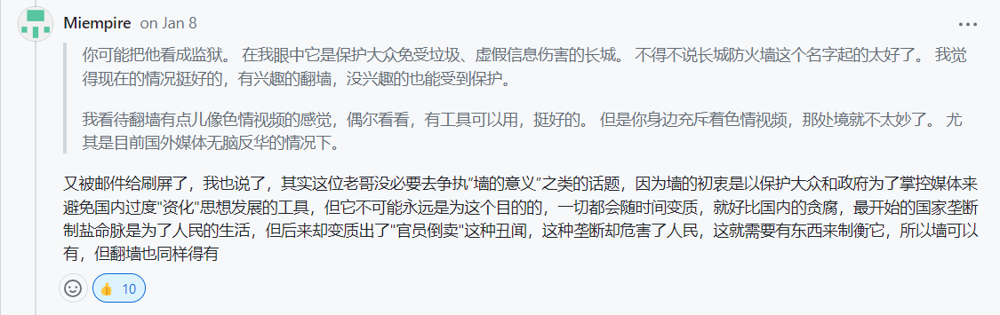

# 😻 clash系列备份

clash for windows在2023年的11月2号删除后，第二天，clash内核删库、clash meta内核归档、clash verge归档、clashx删库、clash for andriod删库、clash meta for andriod删库......

### [google drive备份](https://drive.google.com/drive/folders/1iAXVXOSYvWlGM4Hod2nlyNwCxmnBjqAb?usp=sharing)

<figure><figcaption></figcaption></figure>

### [onedrive备份](https://1drv.ms/f/s!AkOlsYD5Bd9Nklmj0oTmMX3C1ggS?e=g5Za5F)

<figure><figcaption></figcaption></figure>

[tg频道备份](https://t.me/crossthegfw)

<figure><figcaption></figcaption></figure>

得益于[互联网档案馆](https://archive.org)，上述备份的软件的官方教程得以保留，相应的链接，均可在tg频道中找得。经过这次备份，我再次感受到了互联网档案馆的强大。等有钱了，一定给互联网档案馆捐赠10刀。上一次我捐赠是今年年初。明年年初，过年拿了压岁钱，分10刀给互联网档案馆。
