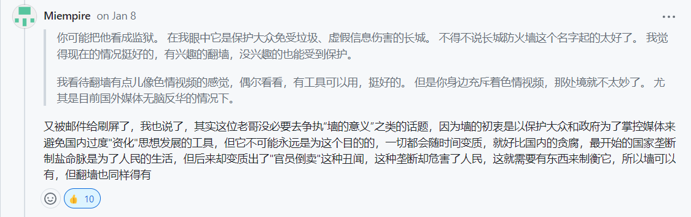

# 软件翻墙

### VPN【Virtual Private Network，虚拟私有网络】

设计的初衷是为了更安全地进行网络传输。【数据的安全性和网络的匿名传输】

由于其信息加密无法被GFW探测，而被大量用于翻墙使用。

其主要采用TCP协议。TCP协议需要本地和远程多次握手，建立长连接，并且验证每一次的通信，确保数据按顺序到达并处理。但其容易被GFW通过发送reset包来阻断。

优点：

* 端对端加密，避免通讯流量被中间劫持以后泄密。
* 近乎所有的流量都能被代理。

缺点：特征很明显【都是最先发送一个建立加密通道的数据包】，容易被GFW探测。

VPN从绝对用户基数上说，是主流。

对于GFW而言，现在的VPN相当于是光着屁股在墙的脸上摩擦。能用是因为还没被封或者刚刚换了IP，不代表你应该用下去。强烈推荐学习使用Socks5代理的方式【及Shadowsocks、SSR、V2ray这类工具】。

### WireGuard

原理和VPN一样，其采用了更先进的加密技术和更为低调的UDP协议进行传输，特征依然明显。

采用UDP协议，UDP协议不管对面有没有在听，都会发送数据包，而且也不建立长连接，也没有通过时间戳来验证数据包完整性和顺序性的机制。

这款工具不适合翻墙，也不应该用来翻墙。

### Shadowsocks、SSR、V2ray、Trojan、Xray

Shadowsocks的设计初衷是为了避免GFW进行关键词阻断。其引出了一个把代理服务器拆分成本地和远程两个的概念。Shadowsocks在本地完成加密，过墙的数据已经是加密数据了，因此GFW无法探测到固定的模式和特征。

SSR、V2ray、Trojan、Xray是在Shadowsocks的基础上衍生的产物。以上工具在加密方式和伪装方式上有些许不同。这些工具都采用本地服务器加密流量发送至远程服务器，再进行转发的方式来突破GFW的封锁。

软件翻墙方式的缺点：绝大多数的软件，都没有那么高的底层权限，只能代理应用层的网络流量。

全局代理模式中“全局”的含义：翻墙软件本身所接管到的所有流量，全部转发到代理服务器。

有些软件跑在系统层，权限更高，甚至不遵循操作系统的代理规则，根本不把通讯流量，交给翻墙软件接管。这种情况下，就没有办法实现翻墙了。比较有代表性的应用有一系列的UWP应用【微软商店下载的那些软件】、应用程序商店本身、VR设备的客户端，还有很多的游戏流量等，都不遵循系统代理的设置。
